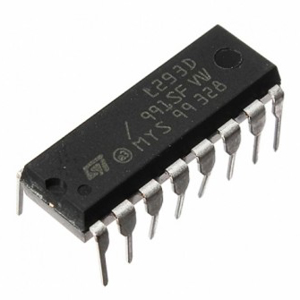
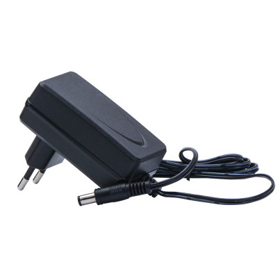
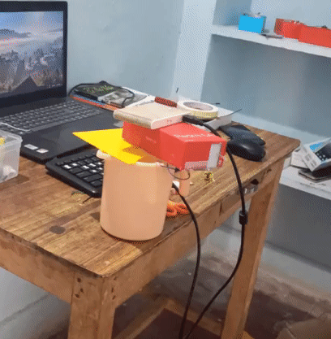

# automatic-hand-sanitizer
<p> it is a device made with arduino , when
you keep the hand below this it will sence that an obstakile is under it and dispense the 3ml of sanitizer .this device is very usefull in this world of social distancing .
</p>
<h4>#stay_home<br>#stay_safe</h4>
<h2>components required </h2>

<p >1. arduino nano</p><br><br>

<p >2. ultrasonic sensor</p><br><br>

<p >3. dc 5v pump</p><br><br>

<p >4. L293D mtor driver</p><br><br>

<p >5. 5v DC adapter</p><br><br>
<h3>arduino code </h3>

```c
int trig = A4;
  int echo = A5;
  int m1 = 2;
  int m2 = 3;
  int mt = 3000;
  int l=5.0;

  float distance (void)
  {
    long long int time;
    float distance ;
    digitalWrite(trig,LOW);
    delayMicroseconds(70);
    digitalWrite(trig,LOW);
    delayMicroseconds(70);
    time=pulseIn(echo,HIGH);
    distance = (time*340.0)/20000.0;
    return distance;
  }
void setup() {
  // put your setup code here, to run once:
  pinMode (trig,OUTPUT);
  pinMode(echo,INPUT);
  pinMode(m1,OUTPUT);
  pinMode(m2,OUTPUT);
  digitalWrite(m1,LOW);
  digitalWrite(m2,LOW);
}

void loop() {
  // put your main code here, to run repeatedly:
  if(distance()<=5)
  {
    digitalWrite(m1,HIGH);
    digitalWrite(m2,LOW);
    delay(mt);
    digitalWrite(m1,LOW);
    digitalWrite(m2,LOW);
    while(distance()<=5)
    {

    }
  }
  }
```
<br><br>
<h3>demo video for the project</h3>

